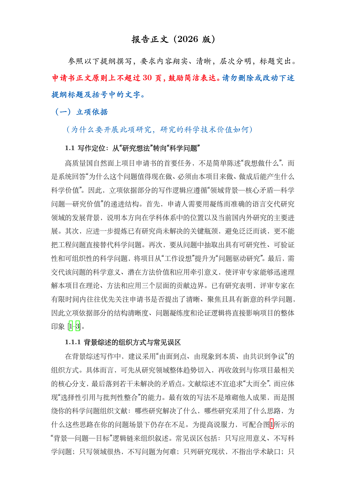

# 国自然面上项目申请书 LaTeX 写作模板

<p align="center">
  
  
  
  
</p>

<p align="center">
  <b>国家自然科学基金面上项目LaTeX正文写作模板与写作范例</b><br>
  <sub>本模板根据2026年国家自然科学基金面上项目Word申请书模板制作</sub>
</p>

---


## 1. 项目简介

本项目是面向国家自然科学基金面上项目正文写作的 LaTeX 模板，基于 main.tex、nsfc.sty、GBT7714.bst、reference.bib 与 .latexmkrc 构建，重点服务于国自然申请书的结构化撰写、写作教学示范与模板复用。项目围绕“如何撰写一份高质量的国自然申请书”为主题，简要展示了立项依据、研究内容、研究基础及其他说明等核心部分的写作逻辑、组织方式与版式实现方法，兼顾学术规范性、逻辑清晰性与实际可操作性，适合高校教师、青年科研人员、研究生以及需要在 GitHub 上发布基金写作模板项目的用户使用。本模板并非国家自然科学基金委员会官方模板，仅供各类科研工作者学习、研究与写作交流使用。

本模板特别适合以下场景：

- 国自然面上项目申请书正文写作；
- 高校教师、研究生和青年科研人员的申请书写作训练；
- 基于 LaTeX 的基金模板维护、升级和 GitHub 开源发布；
- 申请书写作方法课程、科研训练课程或团队内部培训资料。


<p align="left">
  
</p>

## 2. 内容主题

**如何撰写一份高质量的国自然申请书**

该示例包含的内容

- 立项依据如何论证科学问题与研究价值
- 研究内容如何形成清晰、可评审的任务链条
- 研究基础如何体现前期积累与可行性
- 其他说明如何保持信息规范与一致性


## 3. 文件结构

```text
.
├── main.tex
├── nsfc.sty
├── reference.bib
├── GBT7714.bst
├── .latexmkrc
└── images/
    └── fig-example.png
```

## 4. 编译方式

推荐命令行编译：

```bash
xelatex main.tex
bibtex main
xelatex main.tex
xelatex main.tex
```

也可在 TeXstudio 中配置：

```bash
latexmk -xelatex -synctex=1 %.tex
```

## 5. 使用说明

1. LaTeX样式文件: `nsfc.sty`，文献样式文件：`GBT7714.bst`,；
2. `main.tex` 中使用标准 `\section / \subsection / \subsubsection`，便于 TeXstudio 左侧结构栏导航；
3. 参考文献采用数字型引用，示例文献用于说明写作逻辑，不代表 NSFC 官方参考文献清单；
4. 可直接将 `main.tex` 作为正文写作框架，内容逻辑可自行组织，按学科领域替换具体内容。

## 6. 版权与声明

本项目中的模板文件、说明文档及示例内容，仅供学术学习、研究交流和写作训练使用。
任何基于本项目的二次修改、再发布或衍生开发，均应保留原始版权说明与开源协议信息。
本项目不代表国家自然科学基金委员会官方立场，不构成任何官方格式承诺。


## 7. License

本项目采用 MIT License 发布。详见仓库中的 LICENSE 文件。


## 8. Contact

本项目主要用于国家自然科学基金面上项目申请书正文写作的 LaTeX 模板整理、写作逻辑示范与学术交流。
若您在使用过程中发现问题，或希望对模板结构、版式细节、参考文献样式和正文写作逻辑提出改进建议，欢迎通过以下方式联系：

- 联系人：Qingke Zhang
- 所在单位：Shandong Normal University
- 联系邮箱：tsingke@sdnu.edu.cn
- 项目主页：[https://github.com/tsingke/NSFC-LaTeX-2026](https://github.com/tsingke/NSFC-LaTeX-2026)
- Issues 反馈：建议优先通过 GitHub Issues 提交问题与建议
